 

 
 # Analysis of Mass Shootings In America
 
*Statistical Models for Business - MGSC 310, Chapman University - Orange, CA*

*Teresa Gerhold, Josh Anderson, Nick O’Neill, Merzia Cutlerywala*

## **Introduction**

 With the rising issue of mass shootings in America, our group found it to be a relevant topic to do research and analysis to further investigate this issue. Initially, we thought that we could create models that would help us predict the total number of victims of a given mass shooting, however, the models instead indicated significant variables that affect the number of victims if a mass shooting were to occur. 

*The Data*

The first dataset we used to make predictions is the “Stanford_MSA_Database.” This dataset contains metadata of mass shootings in America from 1966 to 2016. A mass shooting is defined as 3 or more people killed in a public place not including the shooter from 1966-2012. After 2012, a mass shooting is defined as a shooting in a public place with 4 or more victims killed not including the shooter. Some data fields in this dataset are city, state, date, brief description, fatalities, injured, venue, mental health history, possible motive, type of weapon/details, number of weapons, shooter name/age/race/gender, fate of the shooter, cause of death, and latitude and longitude of where the shooting occurred. Here is a link to the source: https://library.stanford.edu/projects/mass-shootings-america

The second dataset we used is from the NYTimes API. The data pulled from this API contains various metadata about every news article in the NYTimes archive from 1966 to 2016 by month containing the keyword “mass shooting.” From this data, we created a variable *count*, which is an aggregation of the count of all the NYTimes articles containing the keyword “mass shooting” within the previous 30 days of a given shooting. We used the inner-join function to add this variable to the “Stanford*MSA*Database.” 

*Data Cleaning*

Our data cleaning involved aggregating some factor levels in variables since there were inconsistencies in the data entry, resulting in multiple factor levels for the same factor. These include shooter race, the fate of the shooter at the scene, type of gun, shooter’s cause of death, type of place, targeted victims, and a possible motive. We used the select function to remove detailed description columns, replaced NAs for numeric variables with the mean, and corrected the *Date* variable in the NYTimes news dataset to be the correct type. 

*Summary Stats*

Out of the 325 observations and 40 variables, our summary stats brought up some very integral data. We highlighted 5 variables - total number of victims, total number of fatalities, shooter age, total guns, and number of shooters. The standard deviation (9.45) of the total number of victims is pretty high since the difference between max (102) and min (3) number of victims is pretty significant. With a max number of fatalities of 50, the mean of fatalities is 4.03. The mean of shooter age is 31.82 from a range of age from 12-years-old to 70-years-old. Total guns and number of shooters didn’t have large standard deviation of 1.08 and 1.10 respectively and the means are 1.70 and 1.10 respectively.

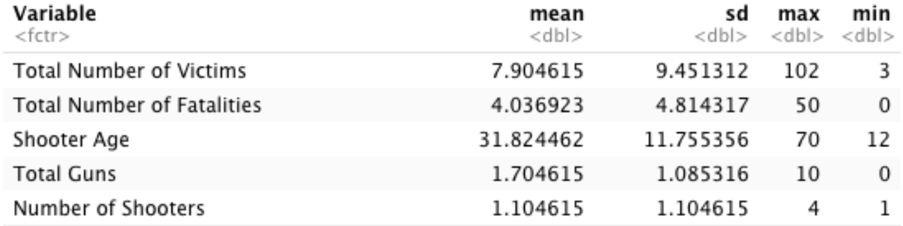

## **Summary Plots**

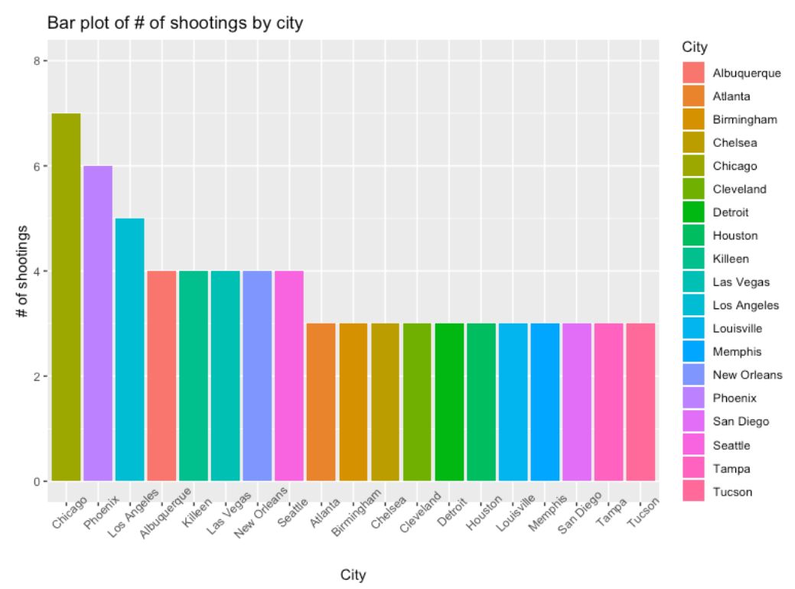

The first summary plot that we explored was a histogram of the number of shootings by city. We chose to do this as a basic exploration to see if there were any obvious trends that we wanted to look into further. The results of this histogram showed that the cities with the highest number of shootings were Chicago, Phoenix, and Los Angeles.

---

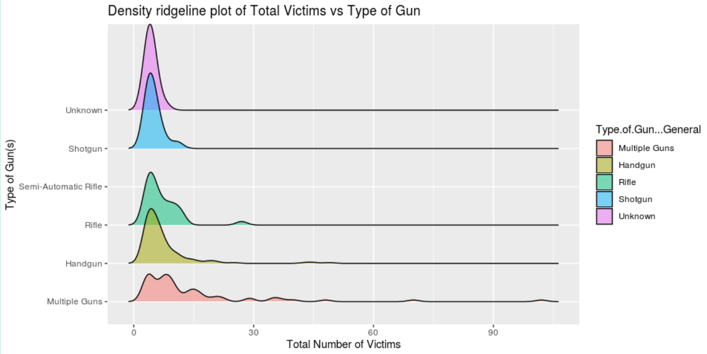

The second summary plot was a density ridgeline plot that we used to explore how the type of gun affected the total number of victims. The graph shows that multiple guns had the widest spread density as well as the largest total victims for one shooting. You will notice that semi auto rifles are listed with no density. This is because there were a limited number of shooting with semi auto so those data points were included in the rifle value.

--- 

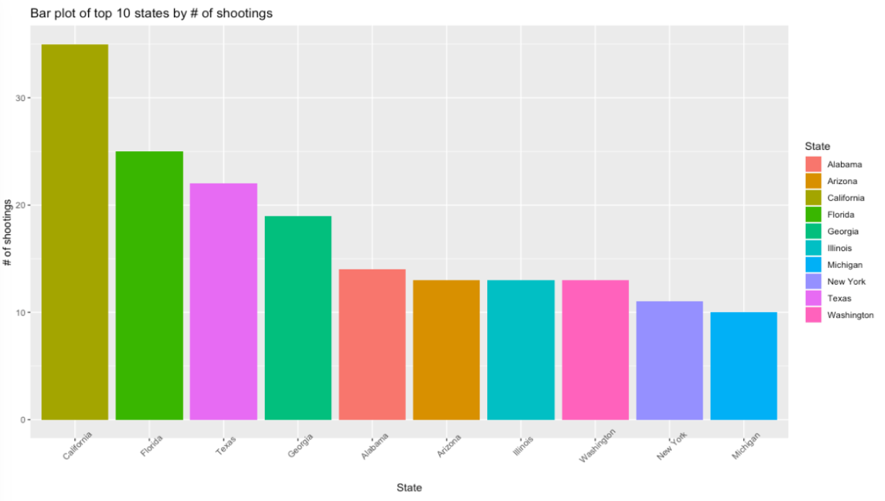

The third summary plot that we explored was a bar plot that showed the number of shootings by state for the top ten states. The results of this were that California had significantly the highest number of shootings, followed by Florida, Texas, and Georgia.

---

NYTimes Article Count      |  Sum of Total Vicitims
:-------------------------:|:-------------------------:
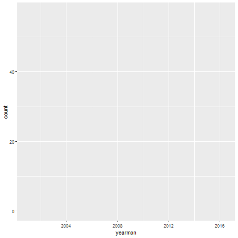  |  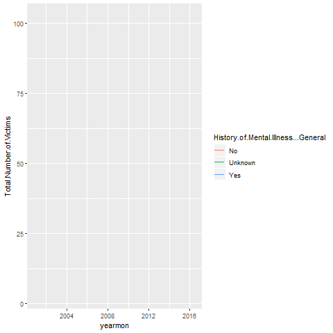

The fourth & fifth summary plots are animated time series line charts. Both graphs have an X-axis over the time period 2000-2016 as that period has the most interesting variance in the data where the time is aggregated by the variable *yearmon* which is every month of every year that a shooting occurred. The left plot has a Y-axis of *count* which is the sum of the number of articles published within 30 days prior to a shooting. The right plot has a Y-axis of the sum of the total number of victims of every shooting in a given month also separated out whether the shooter was known to have mental health illness or not. Something to be noticed about observing these two graphs next to each other is that the number of victims from shooters with a history of mental health illness seems to spike at similar times as the number of articles were published prior to the shooting. Another interesting aspect of this graph is the spike at the end very end on both graphs which is related to the pulse nightclub shooting in 2016. The pulse nightclub shooting had 102 total victims 50 of which were killed, and the article count spike is from a shooting that  happened two weeks later in a nightclub in South Carolina, potentially being a result of the 57 articles released by the NYTimes about the pulse  shooting. 

---

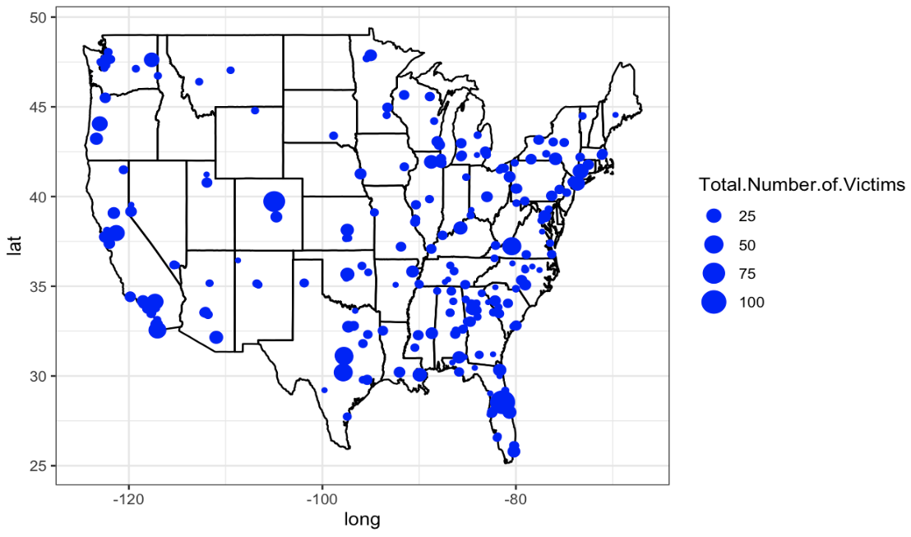

The final summary plot that we made was a map of the United States that showed the location of the mass shootings in the data set along with a dot size that represented the total number of victims in the incident. Similar to the histogram by city, we chose to do this to see an overview of the incidents and to check for any prominent trends. The conclusions we were vaguely able to draw from this plot were shooting locations seem to  be closer together on the East Coast, some few incidents in the middle of the United States, but generally spread out over the entire country. 

## **Predictive Models**

*ElasticNet*

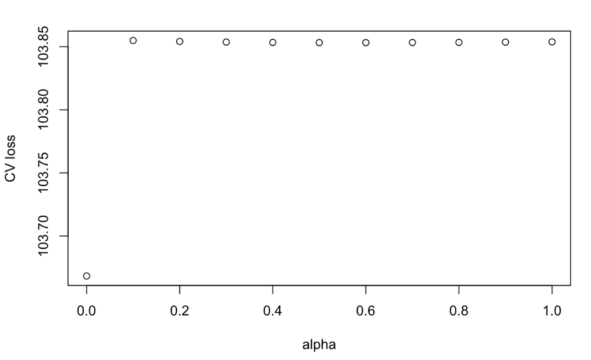

The first type of model that we selected to use was ElasticNet. We selected to use ElasticNet so that we could find the optimal alpha instead of  forcing the data to fit a ridge or lasso model. We created the model that was predicting the total number of victims against all over variables in the dataset. Our next step was to create a minlosspot. The minloss plot clearly showed that the cross-validated loss is lowest when alpha is zero, meaning that a ridge model is the best model for our dataset.

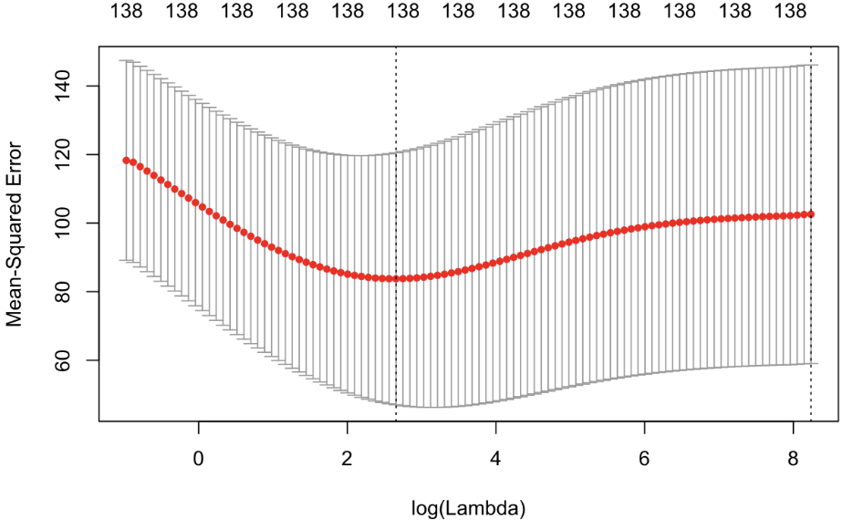

From there, we created a ridge model that also was predicting the total number of victims against all other variables. The minimum lambda selected by this model was at approximately 2.5, which selected 138 variables from the dataset. We used the minimum lambda along with the ridge model to formulate predictions for both the training and testing sets. The RMSE for training set is 7.158553, MAE is 3.723099, and the R2 is .5912334. For the testing set, the RMSE is 5.9811, MAE is 4.034448, and R2 is 0.178672. The most important outcome from these diagnostics is that the ridge model is very overfit because the R2 decreases significantly from the training to the testing set. This means that this ridge model does not have good predictive power to predict the number of total victims, but the variables that it selects are still relevant to the overall purpose of trying to mitigate the total number of victims in any given mass shooting. 

The conclusions that we were able to draw from the results of this ridge model were that the factors that are most likely to lead to an incident with more victims are a shooter with no military experience, being in the state of Colorado or Connecticut, and the place of the incident being a military facility. Conversely, this model was able to identify the following variables as factors that likely would lead to an incident with fewer victims: being in Iowa, Utah, North Carolina, or New Jersey, and incidents that occur in a park or the wilderness. These conclusions were interesting because the summary plots showed that the most number of mass shootings happened in California, Florida, and Texas, yet none of those states were not  selected as factors that lead to a higher number of victims.

*Random Forest*

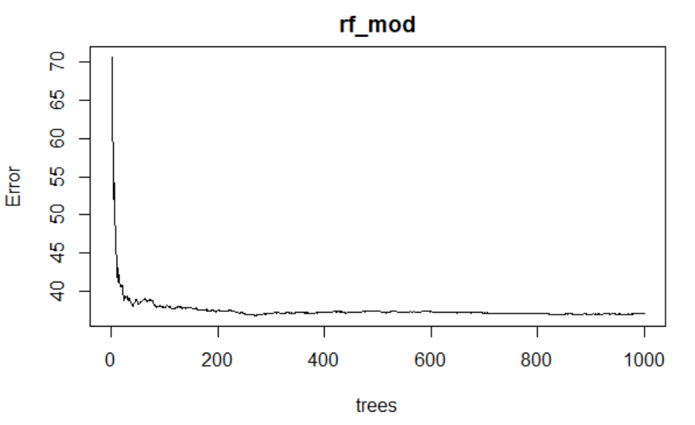

We started our random forest analysis by attempting to tune metrics such as number of trees, including variables, etc. to obtain the best fit results. The random forest model used regression to predict the number of total victims, injured and killed, using all of our selected variables as predictors. We started an initial attempt with a thousand trees. Looking at a plot of number of trees vs. out of bag error, we concluded that around 275 trees was a valid number with the goal of minimal number of trees while also having the lowest error. 

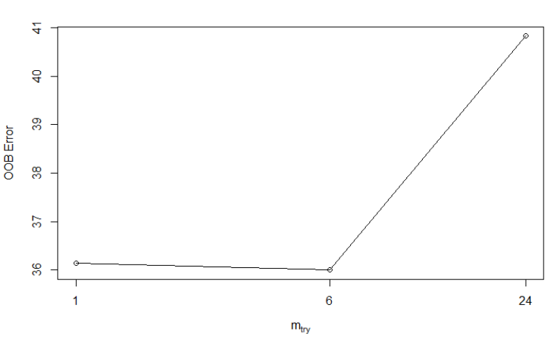

Next was tuning the *mtry* variable, representing the number of variables available to split each tree node. There are several methods of tuning this variable, but we decided to use a pre-built algorithm “tuneRF” from the “randomForest” library that cross-validates the different values of *mtry* for the lowest out of bag error.

Once these parameters were set, we ran the model on a 80/20 training & testing split. The diagnostics for the training set were the following: RMSE is 2.7437, MAE is 1.4519, and R2 is 0.9475. The diagnostics for the test set were the following: RMSE is 15.2137, MAE is 6.1241, and R2 is 0.2661. The difference in error is only slightly higher in the test set, but we notice that the R2 value has plummeted to a lowly 0.2661 showing the model to be very overfit. A possibility for this is the number of variables we put in our data. The *state* variable has 50 factor levels in itself, but even after retraining the model without the *state* variable, the error improved with an RMSE of 4.2575 and MAE of 2.9205, but the R2 remains low at a 0.2785. Because of this lack of improvement, the rest of the analysis includes the *state* variable.

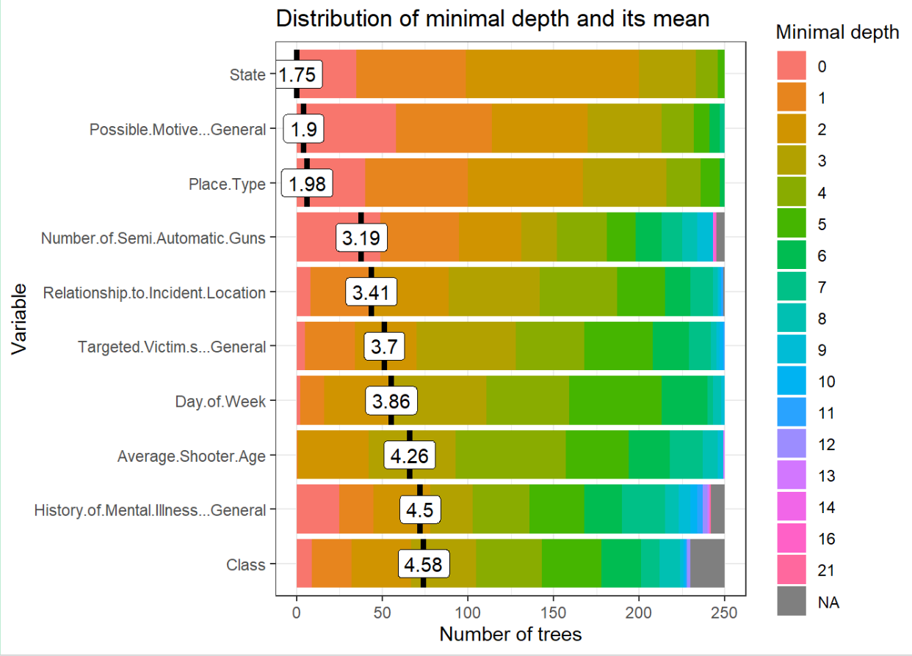

Looking at the average minimal depth of each variable, the top four were *State* - 1.75, *Possible Motive* - 1.9, *Place Type* - 1.98, and *Number of Semi-Auto Guns* - 3.19. This showed that even though this model does not have strong predicting power, there are still some conclusions that can come from this, having these four variables stand out. 

mean_min_depth vs time_a_root | mse_increase vs node_purity_increase
:-------------------------:|:-------------------------:
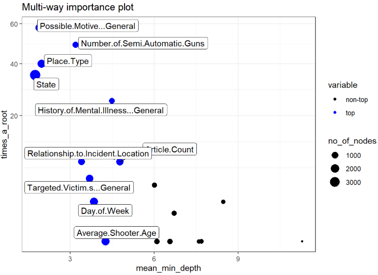  |  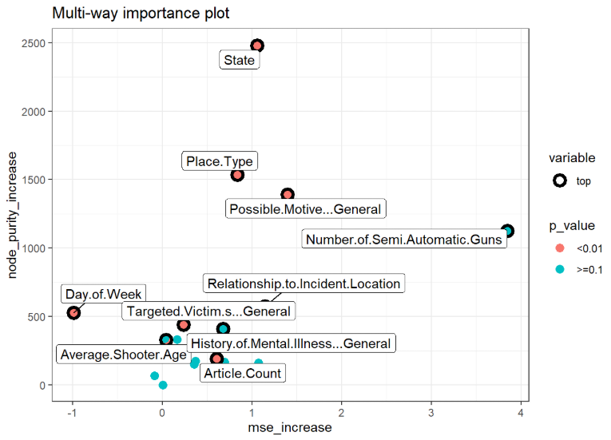

Looking at the two importance plots, we see that those four variables are grouped on the number of times they were a root node and their purity showing high significance. *History of Mental Health Illness* also was selected as a root node a large number of times but the average minimum depth was 4.5 so we did not explore that any further. On the importance plot of purity vs mse_increase, we see that *Number of Semi-Auto Guns* is actually somewhat far from the rest of the group, adding a significant amount of error to the model. It also is shown to have a p-value of >= 0. which is significantly over the level of significance of 0.01, which *State, Place Type,* and *Possible Motive* p-values are all under. This led us to conclude from this model that there are three significant variables round by the random forest that affect total number of victims: *State, Place Type,* and *Possible Motive*.

*K-means*

The last model we created was a K-means cluster plot. We used K-means in order to discover if there is a similarity in characteristics across the different clusters. Those similarities could help us classify the different types of mass shootings that occur into groups. 

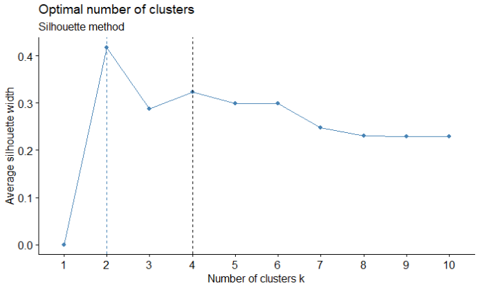

The first step in making a k-means cluster is selecting the variables. When making a k-means cluster you are limited to only selecting numeric variables. We originally ran the k-means with all are numeric values but then changed to use only variables with significance. Using what we learned from the random forest model we took out the variables *Number of Automatic, Number of Semi Auto, Number of Shotguns and Count*. This left the variables *Number of shooters, Total number of Victims* and *Average Age*.

The second step is selecting the K. To figure out the best K we ran both a silhouette and NbClust. We ran both to validate that the K from the silhouette was backed by NbClust. From these two graphs we were able to determine that 3 was the best K.

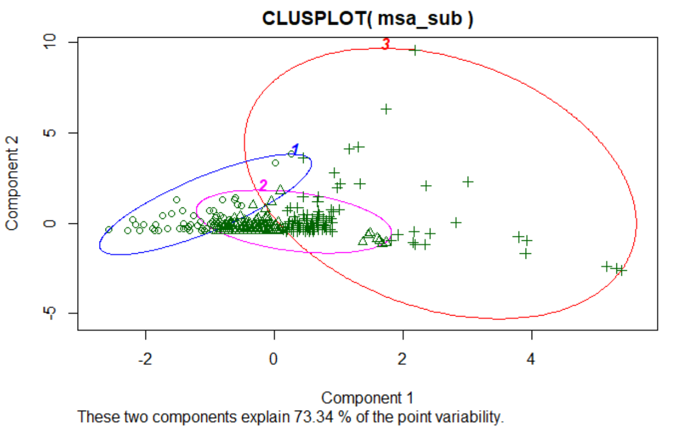

Finally we ran a clusplot on our k-means to get our cluster plot. From our plot we found some interesting data. The size of each plot was 67 in cluster 1, 141 in cluster 2 and 117 in cluster 3. The Cluster means for each variable by cluster; *Total Number of Victims* 8.49, 5.33, 10.68 *Number of Shooters* 1, 1.06, 1.21 *Average Shooter Age* 49.15, 33.14, 19.99. Even though a majority of the shooters are around 30 years of age, mean was 31.8, that demographic seems to have significantly less victims than the other cases. The difficulty with K-means is that it has a difficult time with outliers. Cluster 3 has very high variability with having a larger number of the outliers potentially skewing the number to be larger. Despite the potential skew the average seems to generally be larger for cluster 3.

**Business application and Conclusion**

By analyzing a dataset of this nature, it could be useful for schools and workplaces to track information on students or employees to be aware of how many people are at risk in a given situation and what factors they could change to reduce that number. Also by finding what factors are most impactful in mass shootings, these organizations could learn how the impact of mental health, relations, possible motive, and other variables play into these tragedies and how important of a factor it is to address beforehand. We found that these factors can limit the people at risk in a mass shooting: State, Place Type, Possible Motive, and Relationship to Incident Location. All in all, what we took away from this dataset was the total number of victims or the severity if a shooting were to occur. This information is very useful to gain real, data-driven perspective on the effects of a mass shooting.

