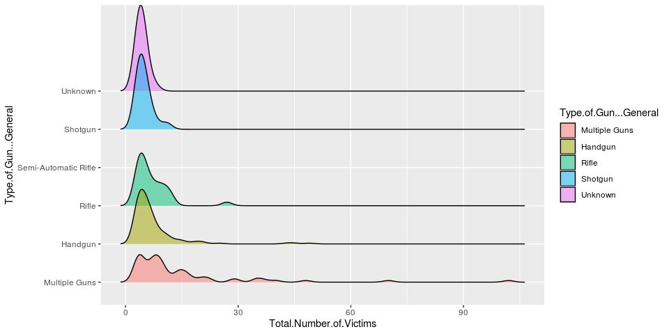
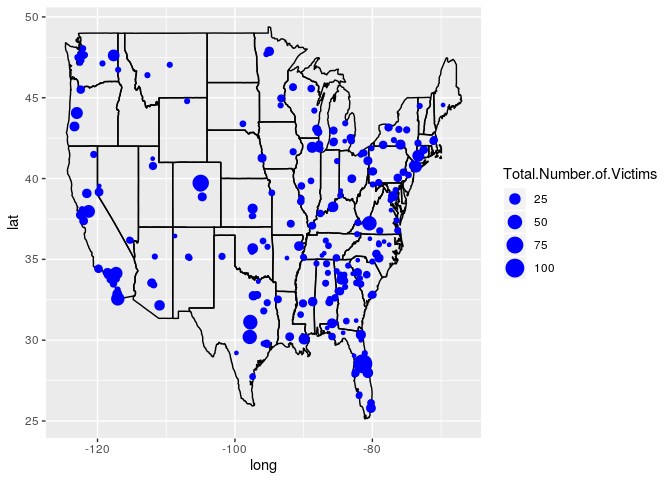

Analysis of Mass Shootings in America
================
Teresa, Nick, Josh, Merzia

12/12/2019

# Environment Setup

``` r
knitr::opts_chunk$set(echo = TRUE, eval = FALSE)

# data manupulation
#install.packages("tidyverse")
#install.packages("magrittr")
#install.packages("zoo")
#install.packages("lubridate")
library(tidyverse)
library(magrittr)
library(zoo)
library(lubridate)

# plots
#install.packages("ggplot2")
#install.packages("gganimate")
#install.packages("ggridges")
#install.packages("hdm")
#install.packages("maps")
library(ggplot2)
library(gganimate)
library(ggridges)
library(hdm)
library(maps)

# models
#install.packages("randomForest")
#install.packages("glmnet")
#install.packages("glmnetUtils")
library(randomForest)
library(glmnet)
library(glmnetUtils)

# diagnostics
#install.packages("caret")
library(caret)
```

# Data Aquisition and Cleaning

## Loading the Datasets

``` r
stanford_msa <- read.csv("../data/Stanford_MSA_Database.csv")
NYTimes_msa <- read.csv("../data/NYTimes_msa.csv")
```

## Data Cleaning

``` r
# aggregate similar factors
stanford_msa %<>% 
  mutate(Shooter.Race = fct_recode(Shooter.Race,
                                   "Asian American" = "Asian American/Some other race",
                                   "Black American or African American" = "Black American or African American/Unknown",
                                   "White American or European American" = "White American or European American/Some other Race",
                                   "Some other race" = "Some Other Race",
                                   "Some other race" = "Unknown"),
         Fate.of.Shooter.at.the.scene = fct_recode(Fate.of.Shooter.at.the.scene,
                                                   "Custody" = "Arrested",
                                                   "Deceased" = "Killed"),
         Fate.of.Shooter = fct_recode(Fate.of.Shooter,
                                      "Custody/Escaped" = "Custody / Escaped",
                                      "Custody/Escaped" = "FALSE"),
         Type.of.Gun...General = fct_recode(Type.of.Gun...General,
                                            "Multiple Guns" = "\nMultiple guns",
                                            "Multiple Guns" = "Multiple guns",
                                            "Multiple Guns" = "Multiple guns\n",
                                            "Handgun" = "handgun",
                                            "Handgun" = "9-mm"),
         Shooter.s.Cause.of.Death = fct_recode(Shooter.s.Cause.of.Death,
                                               "Suicide" = "Killed/Suicide",
                                               "Not Applicable" = "Not applicable",
                                               "Not Applicable" = "Not Apllicable"),
         Place.Type = fct_recode(Place.Type, "Park/Wilderness" = "Park/Wildness"),
         Targeted.Victim.s...General = fct_recode(Targeted.Victim.s...General,"General public" = "Social/General public"),
         Possible.Motive...General = fct_recode(Possible.Motive...General, 
                                                "Unknown" = "",
                                                "Unknown" = "Terminated/Denied/Reprimanded")) 

# correct column types
stanford_msa %<>% mutate(
  Title = as.character(Title),
  Location = as.character(Location),
  City = as.character(City),
  Shooter.Name = as.character(Shooter.Name),
  Shooter.Age.s. = toString(Shooter.Age.s.),
  Number.of.shooters = as.numeric(as.character(Number.of.shooters)),
  Average.Shooter.Age = as.numeric(as.character(Average.Shooter.Age)),
  Number.of.Shotguns = as.numeric(as.character(Number.of.Shotguns)),
  Number.of.Rifles = as.numeric(as.character(Number.of.Rifles)),
  Number.of.Handguns = as.numeric(as.character(Number.of.Handguns)),
  Number.of.Automatic.Guns = as.numeric(as.character(Number.of.Automatic.Guns)),
  Number.of.Semi.Automatic.Guns = as.numeric(as.character(Number.of.Semi.Automatic.Guns)),
  Total.Number.of.Guns = as.numeric(as.character(Total.Number.of.Guns)),
  Date = as.Date(Date, format="%m/%d/%Y")
)

# remove description columns
stanford_msa %<>% select(-c(CaseID, Description, Possible.Motive...Detailed, 
                            History.of.Mental.Illness...Detailed, Date...Detailed,
                            Targeted.Victim.s...Detailed, Type.of.Gun...Detailed, Notes,
                            Data.Source.1, Data.Source.2, Data.Source.3, Data.Source.4, 
                            Data.Source.5, Data.Source.6, Data.Source.7))

# filter cases with a high confidence depreciation value
stanford_msa %<>% filter(Depreciation == "1") # 1' indicates the case clearly fits the criteria for inclusion in the database

# replace NAs for numeric values with mean
is.numeric.NA <- function(x) return (is.numeric(x) & any(is.na(x)))
replace.NA.mean <- function(x) {
  avg <- round(mean(x, na.rm = T), 0)
  return (ifelse(is.na(x), avg, x))
}

stanford_msa %<>% mutate_if(is.numeric.NA, replace.NA.mean)

# correct column types
NYTimes_msa %<>% mutate(
  Publish.Date = as.Date(Publish.Date)
)
View(stanford_msa)
```

## Joining news data

``` r
dates <- unique(stanford_msa$Date)
article_countByDate <- data.frame()


for(i in 1:length(dates)) {
  curr_date <- dates[[i]]
  count <- nrow(
    NYTimes_msa %>% 
      filter(Publish.Date >= curr_date-30 & Publish.Date < curr_date)
    )
  
  article_countByDate %<>% bind_rows(data.frame(curr_date, count))
}

stanford_msa <- inner_join(stanford_msa, article_countByDate, by = c("Date" = "curr_date"))
stanford_msa %>% select(Date, count)
```

    ##           Date count
    ## 1   1966-08-01     0
    ## 2   1966-11-12     0
    ## 3   1972-12-31     0
    ## 4   1974-01-17     0
    ## 5   1974-12-30     0
    ## 6   1976-02-19     0
    ## 7   1976-07-12     0
    ## 8   1979-01-29     0
    ## 9   1979-10-06     0
    ## 10  1982-03-19     0
    ## 11  1982-08-20     0
    ## 12  1983-02-18     0
    ## 13  1983-08-19     0
    ## 14  1984-02-24     0
    ## 15  1984-06-29     0
    ## 16  1984-07-18     0
    ## 17  1985-01-21     0
    ## 18  1985-03-06     0
    ## 19  1986-08-12     0
    ## 20  1986-08-20     0
    ## 21  1986-12-04     0
    ## 22  1987-04-23     0
    ## 23  1988-02-11     0
    ## 24  1988-02-16     0
    ## 25  1988-05-20     0
    ## 26  1988-09-22     0
    ## 27  1988-09-26     0
    ## 28  1988-12-14     0
    ## 29  1989-01-17     0
    ## 30  1989-08-10     0
    ## 31  1989-09-14     0
    ## 32  1990-06-17     0
    ## 33  1991-11-01     0
    ## 34  1991-10-10     0
    ## 35  1991-10-16     0
    ## 36  1991-11-14     0
    ## 37  1992-05-01     0
    ## 38  1992-09-11     0
    ## 39  1992-10-15     0
    ## 40  1992-12-14     0
    ## 41  1993-07-01     0
    ## 42  1993-05-06     0
    ## 43  1993-05-06     0
    ## 44  1993-07-08     0
    ## 45  1993-08-06     0
    ## 46  1993-09-17     0
    ## 47  1993-12-07     0
    ## 48  1993-12-14     1
    ## 49  1993-12-16     1
    ## 50  1994-05-26     0
    ## 51  1994-06-20     0
    ## 52  1994-11-07     0
    ## 53  1995-01-26     0
    ## 54  1995-03-21     0
    ## 55  1995-04-03     0
    ## 56  1995-11-15     0
    ## 57  1996-02-02     0
    ## 58  1996-02-09     0
    ## 59  1996-08-15     0
    ## 60  1997-02-19     0
    ## 61  1997-09-15     0
    ## 62  1997-10-01     0
    ## 63  1997-12-01     0
    ## 64  1997-12-19     0
    ## 65  1997-12-18     0
    ## 66  1998-03-06     0
    ## 67  1998-03-24     0
    ## 68  1998-04-24     0
    ## 69  1998-05-21     0
    ## 70  1998-10-06     1
    ## 71  1999-04-20     0
    ## 72  1999-05-20     3
    ## 73  1999-07-29     0
    ## 74  1999-09-15     1
    ## 75  1999-11-02     0
    ## 76  1999-12-06     0
    ## 77  1999-12-30     0
    ## 78  2000-12-26     0
    ## 79  2001-02-05     0
    ## 80  2001-03-05     0
    ## 81  2002-01-16     0
    ## 82  2002-10-28     0
    ## 83  2003-05-09     0
    ## 84  2003-07-08     0
    ## 85  2003-08-27     0
    ## 86  2004-11-21     0
    ## 87  2004-12-08     0
    ## 88  2005-03-12     0
    ## 89  2005-03-21     0
    ## 90  2006-01-30     0
    ## 91  2006-03-25     0
    ## 92  2006-08-24     0
    ## 93  2006-08-30     0
    ## 94  2006-09-17     0
    ## 95  2006-10-02     0
    ## 96  2007-02-12     0
    ## 97  2007-04-10     0
    ## 98  2007-04-16     0
    ## 99  2007-10-07     0
    ## 100 2007-10-11     0
    ## 101 2007-10-25     0
    ## 102 2007-12-05     0
    ## 103 2007-12-09     0
    ## 104 2007-12-11     0
    ## 105 2007-12-24     0
    ## 106 2008-02-07     0
    ## 107 2008-02-14     0
    ## 108 2008-06-25     0
    ## 109 2008-07-24     0
    ## 110 2008-10-26     1
    ## 111 2008-12-24     0
    ## 112 2009-03-10     0
    ## 113 2009-03-29     0
    ## 114 2009-03-29     0
    ## 115 2009-04-03     0
    ## 116 2009-11-05     0
    ## 117 2009-11-29     5
    ## 118 2010-02-12     0
    ## 119 2010-08-03     0
    ## 120 2011-01-08     1
    ## 121 2011-02-06     1
    ## 122 2011-04-06     0
    ## 123 2011-07-07     0
    ## 124 2011-09-06     0
    ## 125 2011-10-12     0
    ## 126 2012-02-22     3
    ## 127 2012-02-27     2
    ## 128 2012-04-02     0
    ## 129 2012-04-06     0
    ## 130 2012-05-30     0
    ## 131 2012-06-09     0
    ## 132 2012-07-20     0
    ## 133 2012-08-05     7
    ## 134 2012-09-27     2
    ## 135 2012-09-28     2
    ## 136 2012-10-21     2
    ## 137 2012-12-11     0
    ## 138 2012-12-14     0
    ## 139 2013-01-19    14
    ## 140 2013-01-30    11
    ## 141 2013-02-03    11
    ## 142 2013-02-19     8
    ## 143 2013-04-21     6
    ## 144 2013-04-24     6
    ## 145 2013-06-07     1
    ## 146 2013-07-26     0
    ## 147 2013-08-05     0
    ## 148 2013-08-14     0
    ## 149 2013-09-16     0
    ## 150 2013-10-21     2
    ## 151 1971-11-11     0
    ## 152 1991-08-09     0
    ## 153 2005-02-24     0
    ## 154 2013-03-13     7
    ## 155 2013-11-01     1
    ## 156 2013-08-07     0
    ## 157 2013-12-28     2
    ## 158 2014-03-23     2
    ## 159 2014-04-02     2
    ## 160 2014-04-29     6
    ## 161 2014-05-23     0
    ## 162 2014-06-05     0
    ## 163 2014-06-08     1
    ## 164 2014-06-29     3
    ## 165 2014-08-08     1
    ## 166 2014-10-24     2
    ## 167 2014-11-19     2
    ## 168 2014-02-20     0
    ## 169 1994-12-30     0
    ## 170 2012-01-29     3
    ## 171 2014-12-15     1
    ## 172 2015-01-01     1
    ## 173 2015-01-10     0
    ## 174 2015-01-24     0
    ## 175 2015-01-28     0
    ## 176 2015-02-10     1
    ## 177 2015-02-07     1
    ## 178 2015-02-26     1
    ## 179 2014-12-01     0
    ## 180 2015-02-07     1
    ## 181 2015-02-01     0
    ## 182 2015-02-22     1
    ## 183 2015-02-22     1
    ## 184 2015-02-27     1
    ## 185 2015-02-28     1
    ## 186 2015-03-13     1
    ## 187 2015-03-15     1
    ## 188 2015-03-19     1
    ## 189 2015-03-28     1
    ## 190 2015-03-30     1
    ## 191 2015-04-03     1
    ## 192 2015-04-07     0
    ## 193 2015-04-16     0
    ## 194 2015-04-21     0
    ## 195 2015-04-25     0
    ## 196 2015-05-01     0
    ## 197 2015-05-03     0
    ## 198 2015-05-12     0
    ## 199 2015-05-25     0
    ## 200 2015-05-31     0
    ## 201 2015-05-31     0
    ## 202 2015-06-07     1
    ## 203 2015-06-17     1
    ## 204 2015-06-20     5
    ## 205 2015-05-10     0
    ## 206 2015-06-16     1
    ## 207 2015-07-12    11
    ## 208 2015-07-16    11
    ## 209 2015-07-22     7
    ## 210 2015-07-23     7
    ## 211 2015-08-08     8
    ## 212 2015-08-26     3
    ## 213 2015-08-29     3
    ## 214 2015-09-10     2
    ## 215 2015-09-17     2
    ## 216 2015-10-01     1
    ## 217 2015-10-09    18
    ## 218 2015-02-04     1
    ## 219 2015-09-27     1
    ## 220 2015-10-21    26
    ## 221 2015-10-31    27
    ## 222 2015-11-04    15
    ## 223 2015-10-01     1
    ## 224 2015-11-07    11
    ## 225 2015-11-13     3
    ## 226 2015-11-15     3
    ## 227 2015-11-23     1
    ## 228 2015-11-23     1
    ## 229 2015-11-27     0
    ## 230 2015-12-02     2
    ## 231 2015-12-06    23
    ## 232 2016-01-27     5
    ## 233 2016-02-07     4
    ## 234 2016-02-20     3
    ## 235 2016-02-20     3
    ## 236 2016-02-23     2
    ## 237 2016-02-25     3
    ## 238 2016-02-26     3
    ## 239 2016-02-27     1
    ## 240 2016-03-06     3
    ## 241 2016-03-07     3
    ## 242 2016-03-09     3
    ## 243 2016-03-19     4
    ## 244 2016-03-20     4
    ## 245 2016-03-21     4
    ## 246 2016-03-25     5
    ## 247 2016-03-26     4
    ## 248 2016-01-07    15
    ## 249 2016-01-17     7
    ## 250 2016-01-23     5
    ## 251 2016-01-23     5
    ## 252 2016-01-25     5
    ## 253 2016-01-27     5
    ## 254 2016-01-29     7
    ## 255 2016-01-30     7
    ## 256 2016-01-31     7
    ## 257 2016-02-06     5
    ## 258 2016-02-06     5
    ## 259 2016-02-06     5
    ## 260 2016-02-07     4
    ## 261 2016-02-19     3
    ## 262 2016-02-20     3
    ## 263 2016-02-20     3
    ## 264 2016-02-21     2
    ## 265 2016-02-21     2
    ## 266 2016-02-23     2
    ## 267 2016-02-25     3
    ## 268 2016-02-28     3
    ## 269 2016-02-28     3
    ## 270 2016-03-05     3
    ## 271 2016-03-06     3
    ## 272 2016-03-06     3
    ## 273 2016-03-07     3
    ## 274 2016-03-07     3
    ## 275 2016-03-09     3
    ## 276 2016-03-11     3
    ## 277 2016-03-11     3
    ## 278 2016-03-12     3
    ## 279 2016-03-13     3
    ## 280 2016-03-15     3
    ## 281 2016-03-19     4
    ## 282 2016-03-19     4
    ## 283 2016-03-20     4
    ## 284 2016-03-21     4
    ## 285 2016-03-25     5
    ## 286 2016-04-01     2
    ## 287 2016-04-07     2
    ## 288 2016-04-09     2
    ## 289 2016-04-09     2
    ## 290 2016-04-18     3
    ## 291 2016-04-19     3
    ## 292 2016-04-19     3
    ## 293 2016-04-19     3
    ## 294 2016-04-21     3
    ## 295 2016-04-24     2
    ## 296 2016-04-26     2
    ## 297 2016-04-29     2
    ## 298 2016-04-22     2
    ## 299 2016-04-23     2
    ## 300 2016-04-25     2
    ## 301 2016-05-01     2
    ## 302 2016-05-03     2
    ## 303 2016-05-04     2
    ## 304 2016-05-05     2
    ## 305 2016-05-05     2
    ## 306 2016-05-06     2
    ## 307 2016-05-06     2
    ## 308 2016-05-06     2
    ## 309 2016-05-08     2
    ## 310 2016-05-11     3
    ## 311 2016-05-11     3
    ## 312 2016-05-12     3
    ## 313 2016-05-14     3
    ## 314 2016-05-15     3
    ## 315 2016-05-17     1
    ## 316 2016-05-18     1
    ## 317 2016-05-21     1
    ## 318 2016-05-25     2
    ## 319 2016-05-29     3
    ## 320 2016-05-29     3
    ## 321 2016-05-31     3
    ## 322 2016-06-07     3
    ## 323 2016-06-11     2
    ## 324 2016-06-12     2
    ## 325 2016-06-26    57

# Exploratory Plots

## Density ridge plot of Total Victims by Type of Gun

``` r
ggplot(stanford_msa, aes(x = Total.Number.of.Victims, y = Type.of.Gun...General, fill = Type.of.Gun...General)) +
  geom_density_ridges(alpha = .5)
```

    ## Picking joint bandwidth of 1.41

<!-- -->

## Map of mass shootings

``` r
usa <- map_data('state')
ggplot() +
geom_path(data = usa, aes(x = long, y = lat, group = group)) +
geom_point(data = stanford_msa %>% filter(Longitude > -130), aes(x = Longitude, y = Latitude, size = Total.Number.of.Victims), color = "blue") + geom_density()
```

<!-- -->

## Animated plots on Count & Total Victims over time

``` r
stanford_msa %<>% mutate(year = year(Date), yearmon = as.yearmon(Date))

g <- ggplot(stanford_msa %>% filter(Date > "2000-01-01"), 
             aes(x = yearmon, y = count)) +
  geom_line(color= "blue") +
  transition_reveal(year)

g2 <- ggplot(stanford_msa %>% filter(Date > "2000-01-01"), 
             aes(x = yearmon, y = Total.Number.of.Victims, 
                 color=History.of.Mental.Illness...General)) +
  geom_line() +
  transition_reveal(year)

g
```

    ## Warning: No renderer available. Please install the gifski, av, or magick
    ## package to create animated output

    ## NULL

``` r
g2
```

    ## Warning: No renderer available. Please install the gifski, av, or magick
    ## package to create animated output

    ## NULL

# Analysis

## Select variables and training data

``` r
msa_sub <- stanford_msa %>% select(Total.Number.of.Victims, Day.of.Week, Number.of.shooters,
                                   Average.Shooter.Age, Shooter.Sex, Shooter.Race,
                                   Number.of.Automatic.Guns, Number.of.Semi.Automatic.Guns, 
                                   Number.of.Shotguns, Fate.of.Shooter.at.the.scene, Fate.of.Shooter,
                                   Shooter.s.Cause.of.Death, Place.Type, Relationship.to.Incident.Location,
                                   Relationship.to.Incident.Location, Targeted.Victim.s...General, 
                                   Possible.Motive...General, History.of.Mental.Illness...General, 
                                   Military.Experience, Class, count)


train_idx <- sample(1:nrow(msa_sub), size = .80*nrow(msa_sub))
msa_train <- msa_sub %>% slice(train_idx)
msa_test <- msa_sub %>% slice(-train_idx)
```

## Random Forest

``` r
rf_mod <- randomForest(Total.Number.of.Victims ~ ., data = msa_train,
                       type = regression,
                       mtry = 6,
                       ntree = 275,
                       importance = T)

# Helpful plots
plot(rf_mod)
varImpPlot(rf_mod)
randomForestExplainer::plot_min_depth_distribution(rf_mod)

diagnostics <- function(p, a) {
  print(RMSE(p, a))
  print(MAE(p, a))
  print(R2(p, a))
}
preds_train <- predict(rf_mod, newdata = msa_train, type = "response")
preds_test <- predict(rf_mod, newdata = msa_test, type = "response")

diagnostics(preds_train, msa_train$Total.Number.of.Victims)
diagnostics(preds_test, msa_test$Total.Number.of.Victims)
```

## Elastic Net

``` r
alpha_grid <- seq(0,1, len = 11)
alpha_grid

enet_fit <- cva.glmnet(Total.Number.of.Victims ~ .,
                       data = msa_train,
                       alpha = alpha_grid)
print(enet_fit)
summary(enet_fit)

minlossplot(enet_fit)

plot(enet_fit)

enet_preds_train <- predict(enet_fit, newdata = msa_train, alpha = 0, lambda = 5.97685)
enet_preds_train

enet_preds_test <- predict(enet_fit, newdata = msa_test, alpha = 0, lambda = 5.97685, type = 'response')
enet_preds_test

diagnostics(enet_preds_testm msa_test$Total.Number.of.Victims)
dignostics(enet_preds_train, msa_train$Total.Number.of.Victims)
```

#### Use ridge penalty

``` r
ridge_mod <- cv.glmnet(Total.Number.of.Victims ~ .,
                       data = msa_train,
                       alpha = 0)
summary(ridge_mod)


plot(ridge_mod)

ridge_mod$lambda.min

#training predictions
ridge_preds_train <- predict(ridge_mod, newdata = msa_train, s = "lambda.min", type = 'response')
ridge_preds_train


#testing predictions
ridge_preds_test <- predict(ridge_mod, newdata = msa_test, s = 'lambda.min', type = 'response')
ridge_preds_test

diagnostics(ridge_preds_train, msa_train$Total.Number.of.Victims)
diagnostics(ridge_preds_test, msa_test$Total.Number.of.Victims)
```

#### Get Ridge results

``` r
lam_min_co <- as.matrix(coef(ridge_mod, s = "lambda.min"))
lam_min_co %>% subset(lam_min_co[,'1']< -1.5)
lam_min_co %>% subset(lam_min_co[,'1']> 3.5)
```

## K-means Clustering Model

``` r
# select clustering vars
msa_sub %<>% select_if(is.numeric) %>% select(-c(Number.of.Automatic.Guns, Number.of.Semi.Automatic.Guns, Number.of.Shotguns, count))

# silhouette method
fviz_nbclust(msa_sub, kmeans, method = "silhouette") +
  geom_vline(xintercept = 4, linetype = 2) +
  labs(subtitle = "Silhouette method")

# all methods
Nb_cl <- NbClust(msa_sub, diss = NULL, distance = "euclidean", 
                 min.nc = 2, max.nc = 21, method = "kmeans")

kmeans3 <- kmeans(msa_sub, centers = 3)

clusplot(msa_sub, kmeans3$cluster, color=TRUE, shade=FALSE, labels=5, lines=2)
fviz_cluster(kmeans3, data = msa_sub)
```
